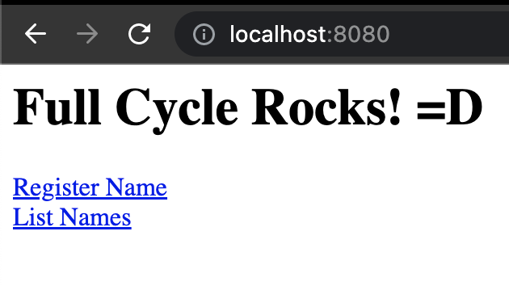
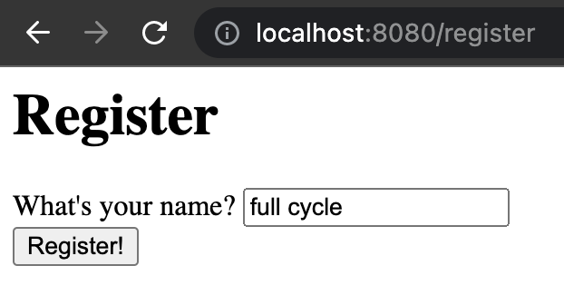
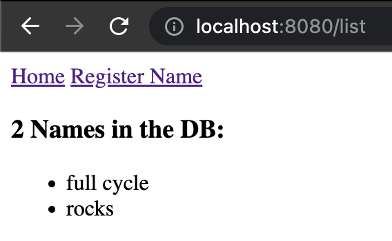

# Full Cycle Node Challenge

This challenge consists of running three services:
1. A `node` server
1. A `mysql` database
1. A `nginx` reverse proxy server

To run everything, simply do the following:

```sh
docker-compose up -d
```

You can then access the server in `localhost:8080`:



To register a name, access `localhost:8080/register`:



You can list all names in `localhost:8080/list`:

